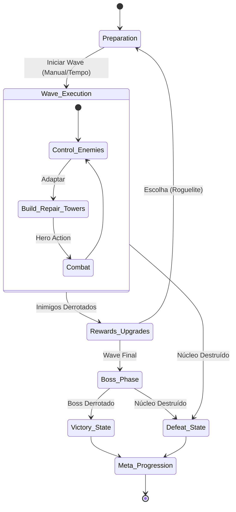

```mermaid
stateDiagram-v2
    direction TB
    
    [*] --> Preparation
    
    Preparation --> Wave_Execution : Iniciar Wave (Manual/Tempo)
    
    state Wave_Execution {
        [*] --> Control_Enemies
        Control_Enemies --> Build_Repair_Towers : Adaptar
        Build_Repair_Towers --> Combat : Hero Action
        Combat --> Control_Enemies
    }
    
    Wave_Execution --> Rewards_Upgrades : Inimigos Derrotados
    
    Rewards_Upgrades --> Preparation : Escolha (Roguelite)
    Rewards_Upgrades --> Boss_Phase : Wave Final
    
    Boss_Phase --> Victory_State : Boss Derrotado
    Boss_Phase --> Defeat_State : Núcleo Destruído
    Wave_Execution --> Defeat_State : Núcleo Destruído
    
    Victory_State --> Meta_Progression
    Defeat_State --> Meta_Progression
    
    Meta_Progression --> [*]
```
