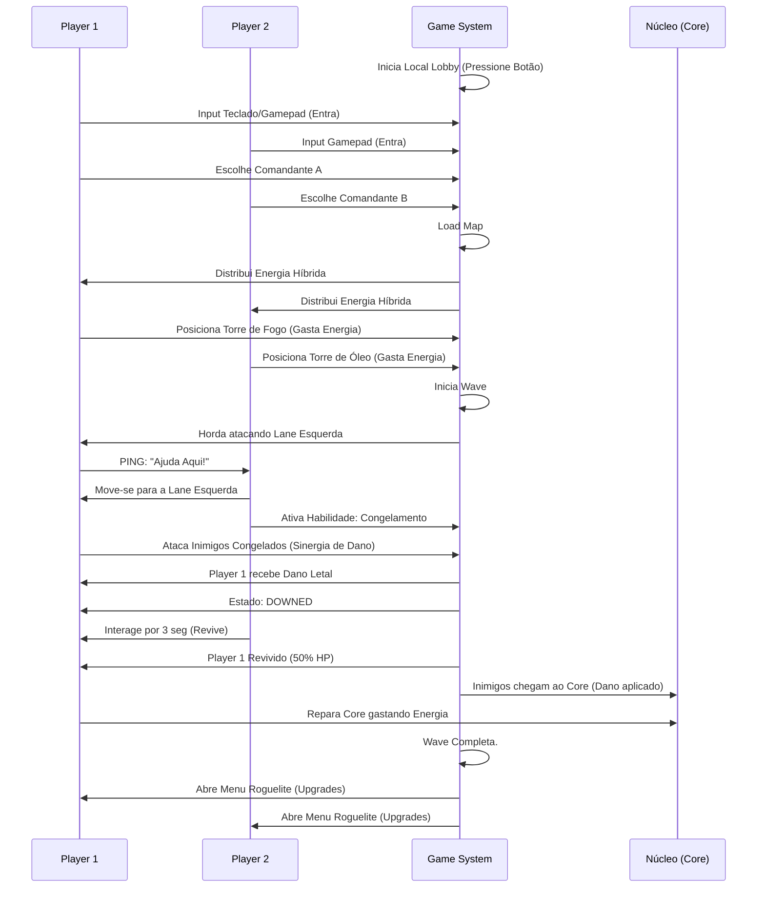

```mermaid
sequenceDiagram
    participant P1 as Player 1
    participant P2 as Player 2
    participant System as Game System
    participant Core as Núcleo (Core)
    
    System->>System: Inicia Local Lobby (Pressione Botão)
    P1->>System: Input Teclado/Gamepad (Entra)
    P2->>System: Input Gamepad (Entra)
    P1->>System: Escolhe Comandante A
    P2->>System: Escolhe Comandante B
    System->>System: Load Map
    
    System->>P1: Distribui Energia Híbrida
    System->>P2: Distribui Energia Híbrida
    
    P1->>System: Posiciona Torre de Fogo (Gasta Energia)
    P2->>System: Posiciona Torre de Óleo (Gasta Energia)
    
    System->>System: Inicia Wave
    System->>P1: Horda atacando Lane Esquerda
    
    P1->>P2: PING: "Ajuda Aqui!"
    P2->>P1: Move-se para a Lane Esquerda
    P2->>System: Ativa Habilidade: Congelamento
    P1->>System: Ataca Inimigos Congelados (Sinergia de Dano)
    
    System->>P1: Player 1 recebe Dano Letal
    System->>P1: Estado: DOWNED
    P2->>P1: Interage por 3 seg (Revive)
    System->>P1: Player 1 Revivido (50% HP)
    
    System->>Core: Inimigos chegam ao Core (Dano aplicado)
    P1->>Core: Repara Core gastando Energia
    
    System->>System: Wave Completa.
    System->>P1: Abre Menu Roguelite (Upgrades)
    System->>P2: Abre Menu Roguelite (Upgrades)
```
